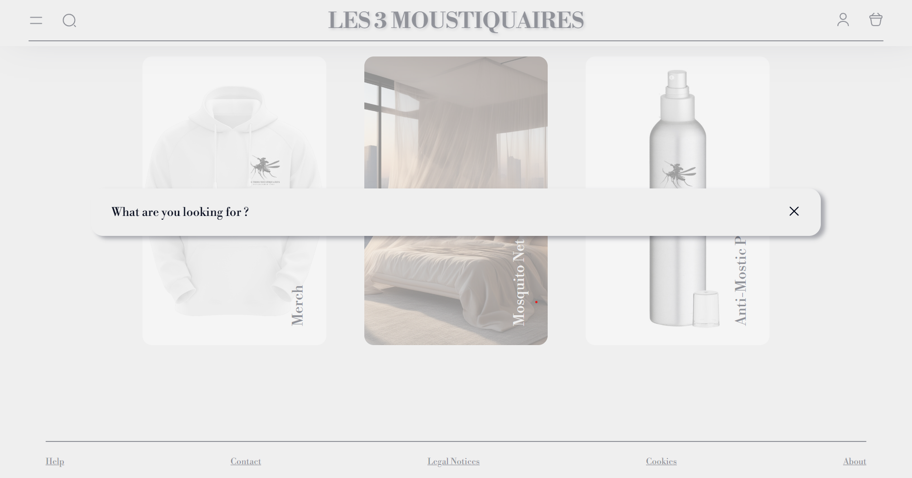

**README.md - Projet "Les3Moustiquaires"**

# Les3Moustiquaires - Site de Vente en Ligne

Bienvenue dans le projet Les3Moustiquaires, un site de vente en ligne proposant une variété de produits. Ce README fournit des informations essentielles sur le projet, son fonctionnement et la manière de le configurer localement.

IP du site internet : 172.26.82.48\
Compte Administrateur : 
- Login : admin@ltroism.com
- Password : l3m_admin

Compte Utilisateur :
- Login : user@ltroism.com
- Password : l3m_user

## Table des matières

1. [Description du Projet](#description-du-projet)
2. [Fonctionnalités](#fonctionnalités)
3. [Captures d&#39;écran](#captures-décran)
4. [Installation](#installation)
5. [Configuration](#configuration)
6. [Utilisation](#utilisation)
7. [Contributions](#contributions)

## Description du Projet

Le projet Les3Moustiquaires vise à créer une plateforme de commerce électronique permettant aux utilisateurs de parcourir, sélectionner et acheter des produits en ligne. Il offre également des fonctionnalités d'inscription, de connexion et de gestion de compte.

## Fonctionnalités

- Présentation des produits avec des descriptions détaillées et des images.
- Ajout de produits au panier et passage de commandes.
- Gestion des comptes utilisateurs, inscription, connexion et gestion de profil.
- Filtre permettant de chercher un produit à l'aide de critères spécifiques (prix, couleur, ...).
- La couleur du site change en fonction du mode de l'appareil (sombre ou clair).
- Administration des produits par les administrateurs (ajout, modification, suppression).
- ...

## Captures d'écran

## Installation

1. Clonez ce dépôt 
2. Accédez au répertoire du projet : `cd eq_04_00_ambroise-thomas_hennequin-felix_julio-baptiste_robineau-anton.git`
3. Installez les dépendances : `composer install`, `npm install`
4. Renomer le fichier `.env.example` en `.env`
5. Générez une clé d'application : `php artisan key:generate`, et établir le lien des images `php artisan link:storage`
6. Lancez le serveur de développement : `php artisan serve`, `npm run dev`

## Configuration

Assurez-vous de configurer correctement le fichier `.env` avec les détails appropriés tels que la base de données, les informations de connexion, etc.

## Utilisation

1. Accédez au site à l'adresse `http://127.0.0.1:8000` dans votre navigateur.
2. Explorez les fonctionnalités du site, créez un compte, ajoutez des produits au panier, etc.

## Contributions

Les contributions sont les bienvenues ! Si vous souhaitez contribuer, vous pouvez envoyer un mail via la page contact du site.

