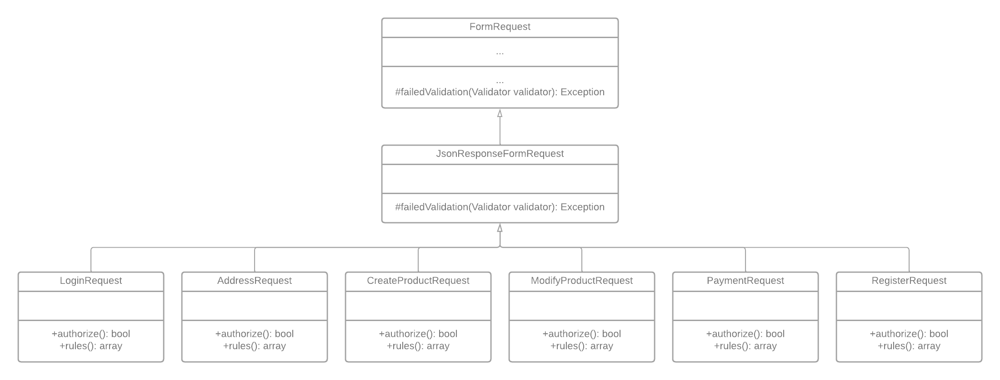
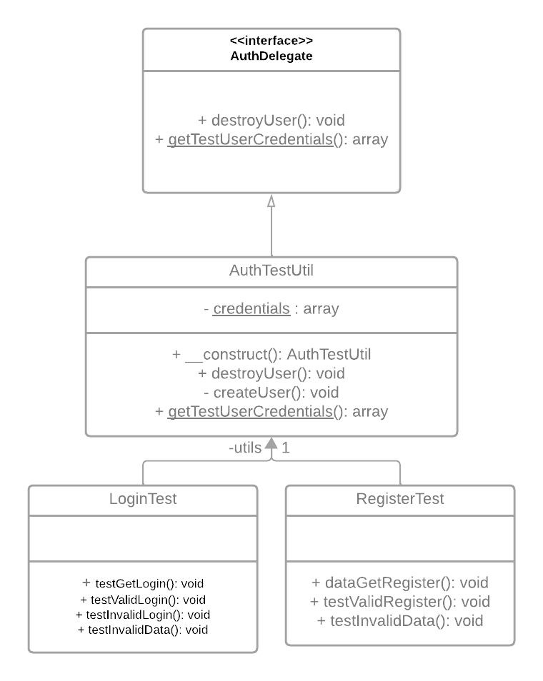

# Les design patterns utilisés dans ce projet
## Sommaire
* [Requests - Template Method Pattern](#requests---template-method-pattern)
* [Authentication Tests - Delegate Pattern](#authentication-tests---delegate-pattern)

## Requests - Template Method Pattern
Pour développer nos cas de tests, nous avons commencé par renvoyer des codes HTTP lors d'une erreur ou d'un succès dans nos contrôleurs. Le souci était que nous utilisons des classes qui héritent de FormRequest pour pouvoir valider un certain format de données. De base, dans ces classes, lorsqu'une validation échoue, on est redirigé vers une autre page, donc on reçoit un code 3XX. Mais dans nos tests, nous sommes censés recevoir une erreur 400 qui signifie 'Bad Request'. Pour remédier à cela, nous avons dû créer une classe nommée JsonResponseFormRequest qui hérite de FormRequest, dans laquelle nous avons modifié une méthode nommée failedValidation() pour faire en sorte qu'elle renvoie un code 400 lors d'un échec de validation. Nous avons donc fait en sorte que toutes nos classes qui héritent de FormRequest héritent maintenant de JsonResponseFormRequest pour éviter la répétition du code de failedValidation(). Ci-dessous, vous trouverez le diagramme UML représentant le fonctionnement du design pattern, le code de la classe JsonResponseFormRequest ainsi que d'une classe qui héritait auparavant de FormRequest en guise d'exemple.

### UML


### /app/Http/Requests/JsonResponseFormRequest.php
```php
<?php

namespace App\Http\Requests;

use Illuminate\Contracts\Validation\Validator;
use Illuminate\Foundation\Http\FormRequest;
use Illuminate\Http\Exceptions\HttpResponseException;
use Symfony\Component\HttpFoundation\Response;

class JsonResponseFormRequest extends FormRequest
{
    protected function failedValidation(Validator $validator): \Exception
    {
        throw new HttpResponseException(
            response()->json([
                'status' => 'error',
                'message' => 'invalid data',
                'errors' => $validator->errors(),
            ], Response::HTTP_BAD_REQUEST)
        );
    }
}
```
### /app/Http/Requests/LoginRequest.php
```php
<?php

namespace App\Http\Requests;

class LoginRequest extends JsonResponseFormRequest
{
    /**
     * Determine if the user is authorized to make this request.
     */
    public function authorize(): bool
    {
        return true;
    }

    /**
     * Get the validation rules that apply to the request.
     *
     * @return array<string, \Illuminate\Contracts\Validation\ValidationRule|array<mixed>|string>
     */
    public function rules(): array
    {
        return [
            'email' => 'required|email',
            'password' => 'required|min:4',
        ];
    }
}
```

## Authentication Tests - Delegate Pattern
Afin de réaliser les tests d'authentification sur le site internet, nous avons mis en place une classe nommée `AuthTestUtil`. Cette classe agit comme un utilitaire pour la création et la suppression d'un utilisateur de test, ainsi que pour la gestion de ses informations d'identification. De plus, nous avons défini une interface appelée `AuthDelegate`, que la classe `AuthTestUtil` implémente. L'utilisation de la classe `AuthTestUtil` facilite la mise en place des tests de connexion, déconnexion et création d'utilisateur. Elle encapsule les fonctionnalités nécessaires à la manipulation de l'utilisateur de test, offrant ainsi une approche structurée et réutilisable pour les tests d'authentification. Ci-dessous, vous trouverez le diagramme UML représentant le fonctionnement du design pattern, le code des classes `AuthDelegate` et `AuthTestUtil` ainsi qu'une class utilisée dans nos tests pour montrer comment nous utilisons `AuthTestUtil`.

### UML


### /tests/Feature/auth/AuthDelegate.php
```php
<?php

namespace Feature\auth;

interface AuthDelegate
{
    public function destroyUser(): void;
    public static function getTestUserCredentials(): array;
}
```

### /tests/Feature/auth/AuthTestUtil.php
```php
<?php

namespace Tests\Feature\auth;

use Tests\Feature\auth\AuthDelegate;

class AuthTestUtil implements AuthDelegate
{
    private static array $credentials = [
        'firstname' => 'Test',
        'lastname' => 'Auth',
        'email' => 'test@test.com',
        'password' => 'password',
        'tel' => '0000000000',
    ];

    public function __construct()
    {
        $this::createUser();
    }

    public function destroyUser(): void
    {
        $email = self::$credentials['email'];
        \DB::unprepared("DELETE FROM users WHERE email='$email'");
    }

    private function createUser(): void
    {
        $credentials = self::$credentials;
        $pass = bcrypt($credentials['password']);
        \DB::unprepared("INSERT INTO users VALUES (0, '${credentials['firstname']}', '${credentials['lastname']}', '${credentials['email']}', NULL, '$pass', 0, 0, NULL, NULL, NULL)");
    }

    public static function getTestUserCredentials(): array
    {
        return self::$credentials;
    }
}
```

### /tests/Feature/auth/LoginTest.php

```php
<?php

namespace Tests\Feature\auth;

use App\Models\User;
use Illuminate\Foundation\Testing\RefreshDatabase;
use Laravel\Prompts\Output\ConsoleOutput;use Tests\TestCase;

class RegisterTest extends TestCase
{
    use RefreshDatabase;

    private $utils;

    /**
     * Test if the route to auth/register as get request return 200.
     * Run the 'npm run dev' command without cutting it off, and then
     * run the test is required.
     */
    public function testGetRegister(): void
    {
        $response = $this->get('auth/register');
        $response->assertStatus(200);
    }

    /**
     * Testing if auth/register return a valid status when the data given is correct.
     * To test if the register feature is correct, we will send as 'post' data including
     * firstname, lastname, email, password and tel, to the right URL and check if the
     * status found is 201. 201 mean that the new user has been succesfully created.
     */
    public function testValidRegister(): void
    {
        $response = $this->post('auth/register', AuthTestUtil::getTestUserCredentials());

        $response->assertStatus(201); // Test if the status code is valid
        // Test if the user has been added to the database
        $this->assertDatabaseHas('users', [
            'email' => 'test@test.com',
        ]);

        $email = AuthTestUtil::getTestUserCredentials()['email'];
        // Remove the added user from the database
        \DB::unprepared("DELETE FROM users WHERE email='$email'");

        // Test if the user has been successfully removed
        $this->assertDatabaseMissing('users', [
            'email' => 'test@test.com',
        ]);
    }

    /**
     * Testing if auth/register return an invalid status when the data given is incorrect.
     * To test if the register feature is correct, we will send as 'post' data including
     * firstname, email, password and tel, to the right URL, but the lastname is missing.
     * And check if the status found is 400, Bad Request.
     */
    public function testInvalidData(): void
    {
        $response = $this->post('auth/register', [
            'firstname' => 't', // firstname is at least 2 characters
            // Missing lastname
            'email' => 'test@test.com',
            'password' => 'password',
            'tel' => '0000000000',
        ]);

        $response->assertStatus(400);
    }

    /**
     * Testing if auth/register return an invalid status when the data given already exists.
     * To test if the register feature is correct, we will send as 'post' data including
     * firstname, lastname, email, password and tel, to the right URL, but the data will
     * be already used by a user in the database. And check if the status found is 409, conflict.
     */
    public function testAlreadyExists(): void
    {
        $utils = new AuthTestUtil(); // Create test user
        $response = $this->post('auth/register', $utils::getTestUserCredentials()); // Create a user using the /auth/register route with same data as the test user
        $response->assertStatus(409); // Assert returned status is 409 conflict
    }
}
```
